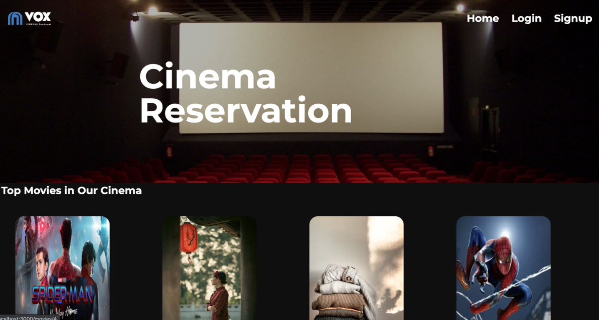
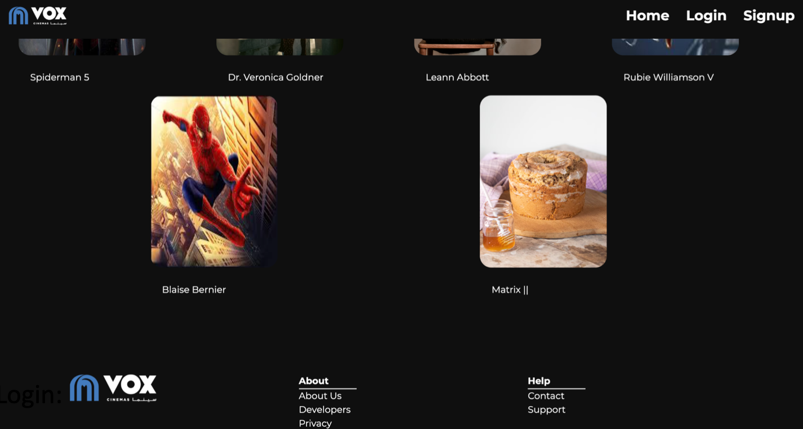
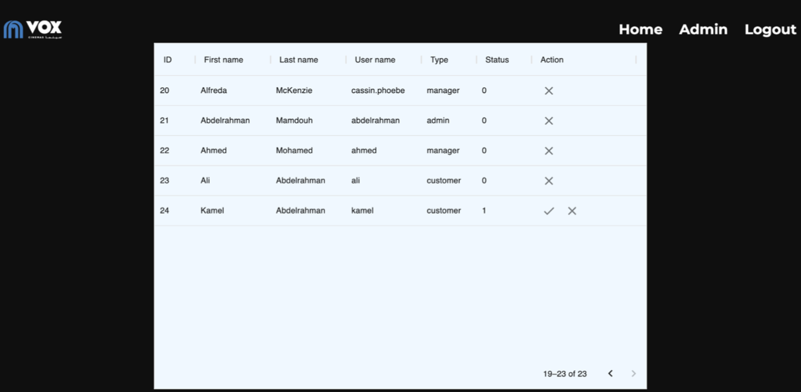
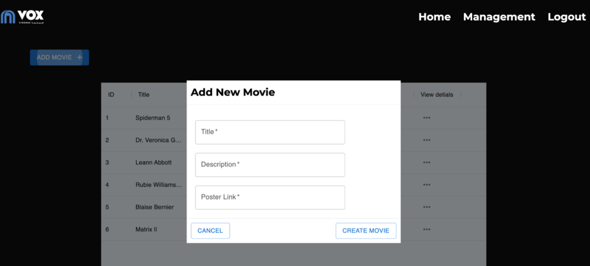
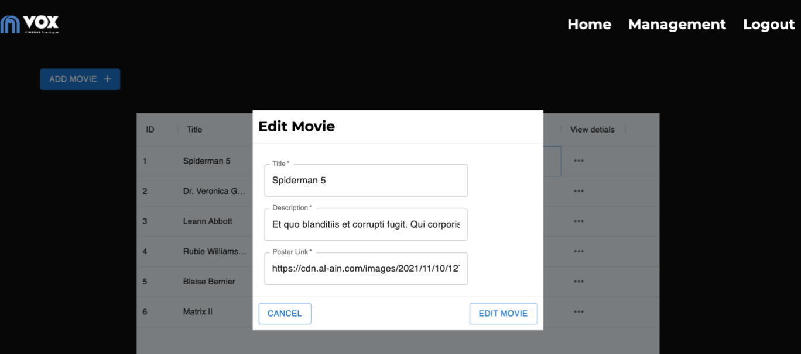
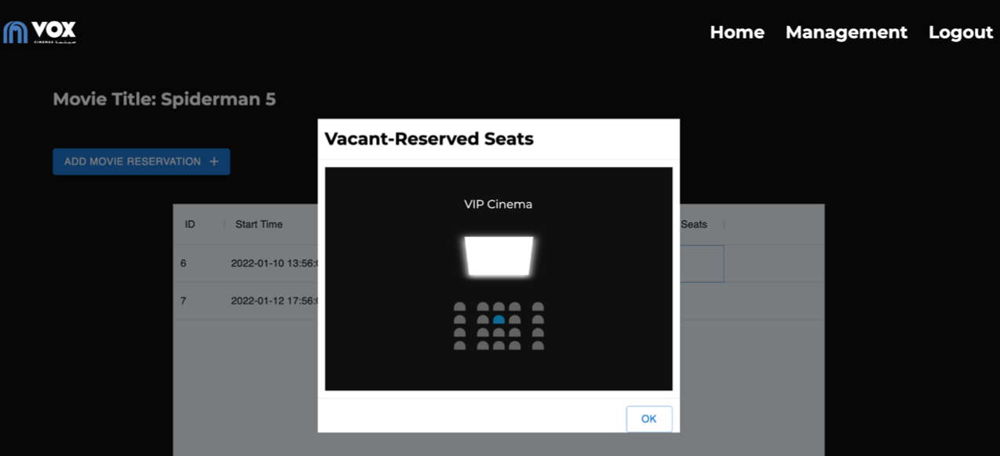
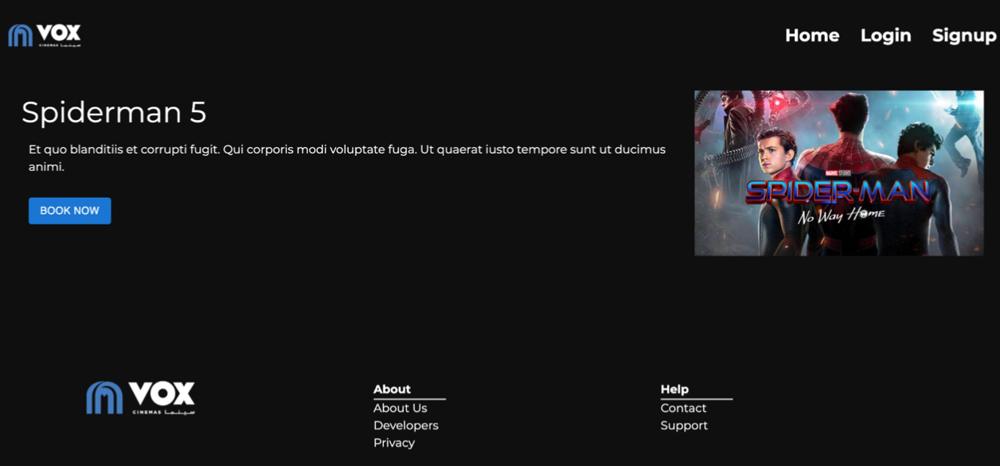
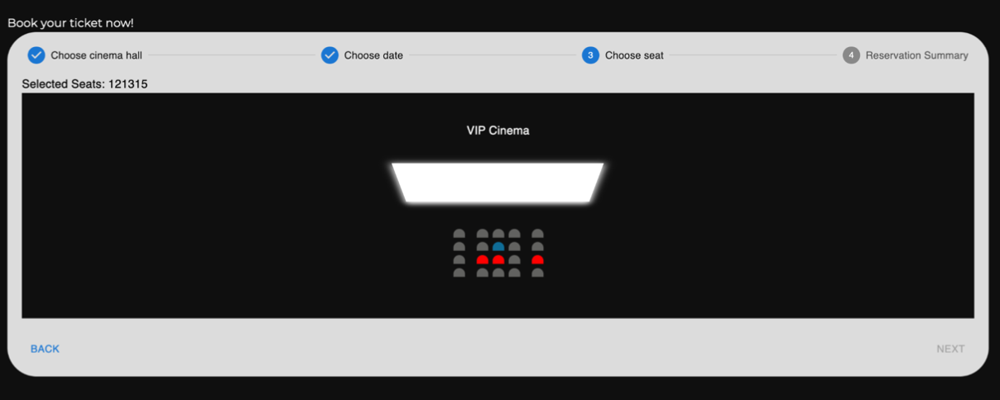

# Cinema Movies Reservation Frontend

This is a project for the course Project where we implement movies reservation system, where a user can login/signup to his account, choose his favorite movie, choose his preferred seats, edit his reservation(seat position/ number of seats/date of reservation). It also provides an admin panel where the admin can add or delete users, create managers. Also there is a management panel, where the manager can create/edit/view movie details.

## How to run:
- install [node](https://nodejs.org/en/download/)

- install and run backend from [here](https://github.com/cufechs/Cinema-Movies-Reservation-System-Backend)

Open terminal/git-bash:
```sh
git clone https://github.com/cufechs/Cinema-Movies-Reservation-System-Frontend.git
cd Cinema-Movies-Reservation-System-Frontend
npm install
npm start
```


## Screenshots

### Homepage


### Admin approves or deletes a manager creation request

### Manager adds a new movie

### Manager can edit details of existing movie

### Manager can view vacant and received seats for a movie 

### Customer can view movie details

### Customer reserving seats (vacant in grey, selected by user in blue, occupied in red)
